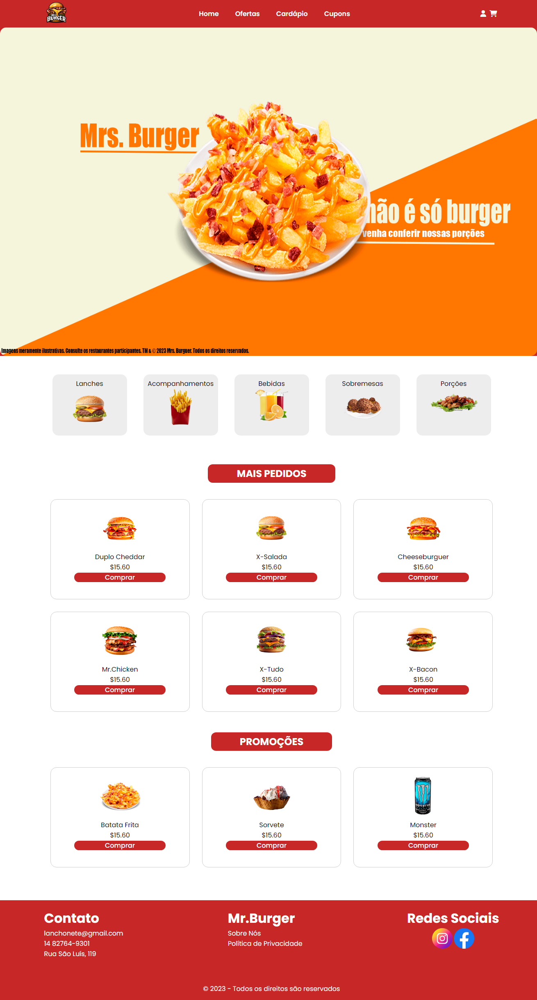

# Mr Burger -

>Mr Burger - Sua lanchonete local!

Projeto feito com intuito de simular uma lanchonete local, construido com HTML5 e CSS

[Clique aqui para acessar](https://gabriel-erk.github.io/projeto-menu-vizinho/)

## Tecnologias

- HTML
- CSS
- Git e Git Hub

## Contato

gabrielmmve13@gmail.com